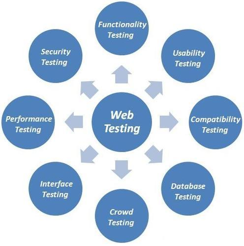

# AutonomiQ : Software Testing Automation

For full documentation visit [autonomiq.github.io](https://autonomiq.github.io).

##Which AutonomiQ can help you?

####AutonomiQ is an autonomous platform that automates every step fo the testing life-cycle from test case creation to impact analysis.

* *Generate script*
######Creating test cases, data, and scripts only take minutes instead of hours (or days) with AutonomIQ. As changes occur, AutonomIQ impact analysis quickly identifies them and self-corrects the test assets to prevent false positives and script issues.

* *Shorten the Time*
######The AutonomIQ solution can easily run tests against different environments, devices, and browsers. Head to head tests between the AutonomiQ platform and incumbent automation tools results in a cycle time reduction from 200 hours to just 5 hours.

##Get in touch

* Email : *sales@autonomiq.io*
* Call us on : `901 - 652 - 5701` *Mon-Sat 9am-9pm (PST)*
* Find us at : *3003 North First Street, San Jose, CA, USA*
